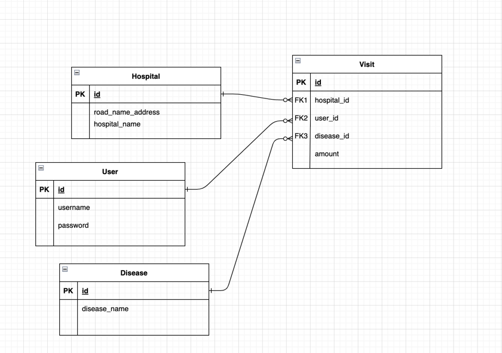

## 다이어그램

## 구현기능

| 기능               |                  api                  |                                                Ex                                                |
|------------------|:-------------------------------------:|:------------------------------------------------------------------------------------------------:|
| 방문기능             |            /api/v1/visists            |  |
| 방문 전체 조회         |        Get   /api/v1/visits        |  |
| 특정 user의 방문기록 조회 |   Get  /api/v1/visits/users/{id}   |  |
| 특정 병원의 방문기록 조회   | Get  /api/v1/visits/hospitals/{id} |  |

